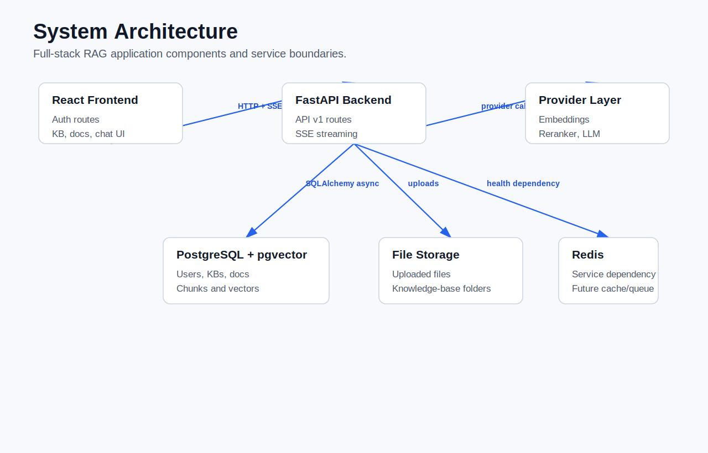
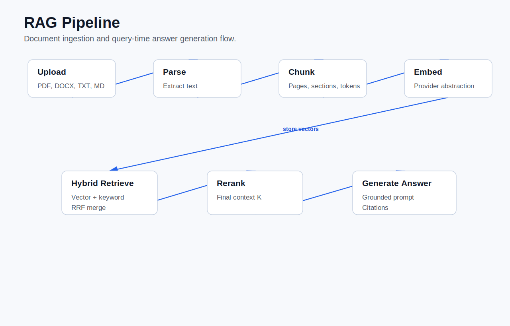
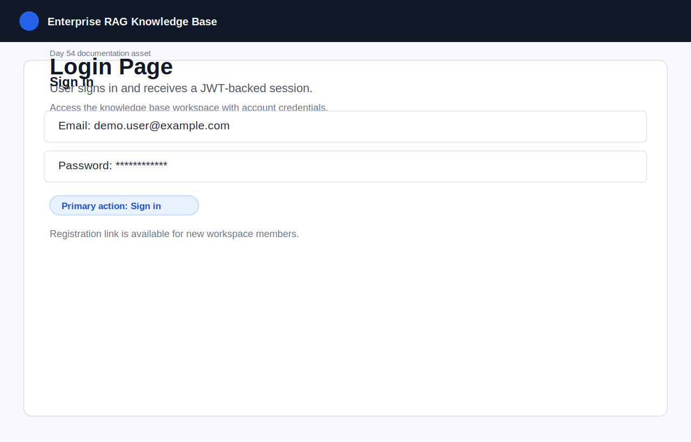
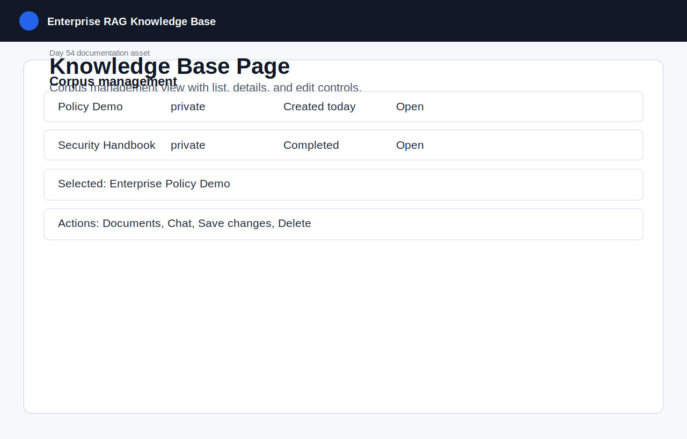
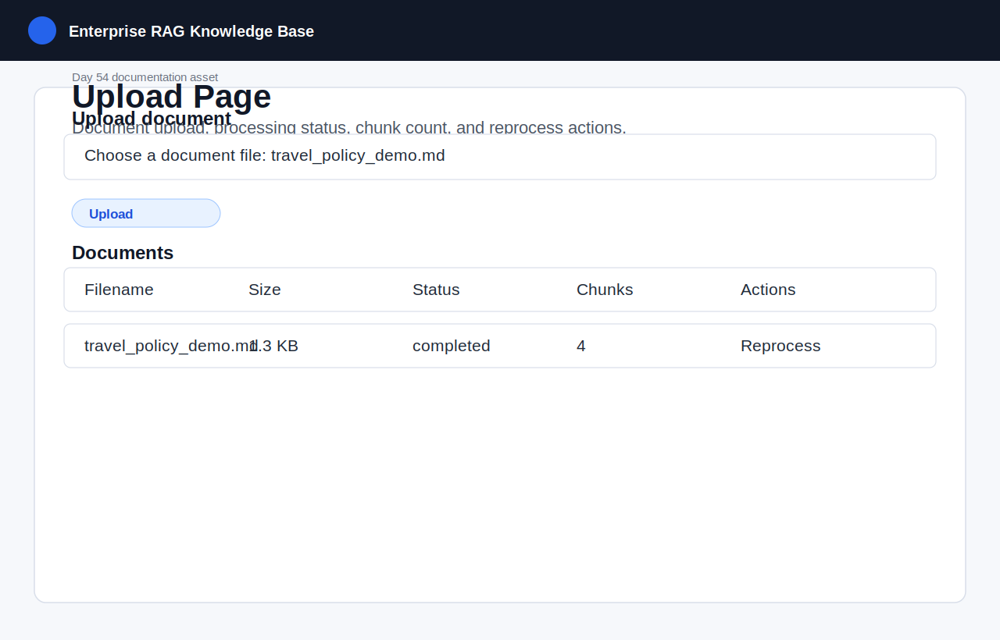
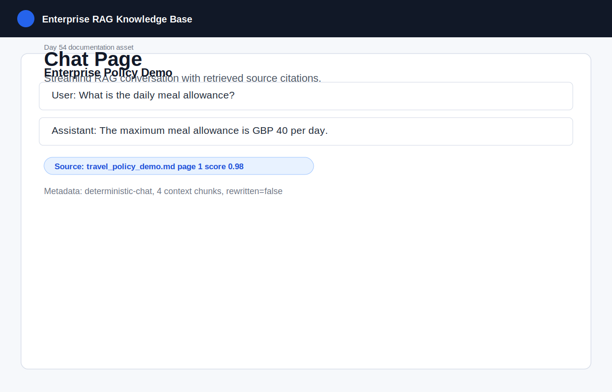
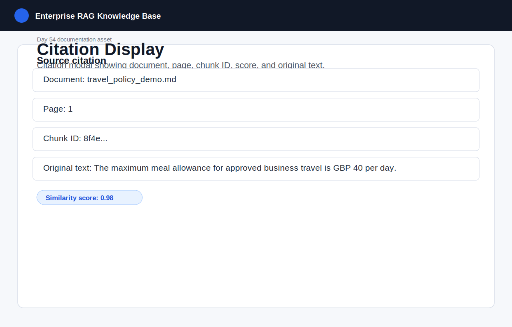
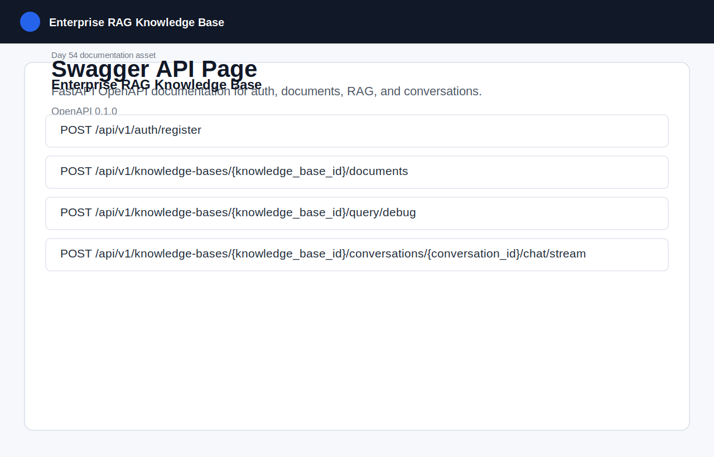
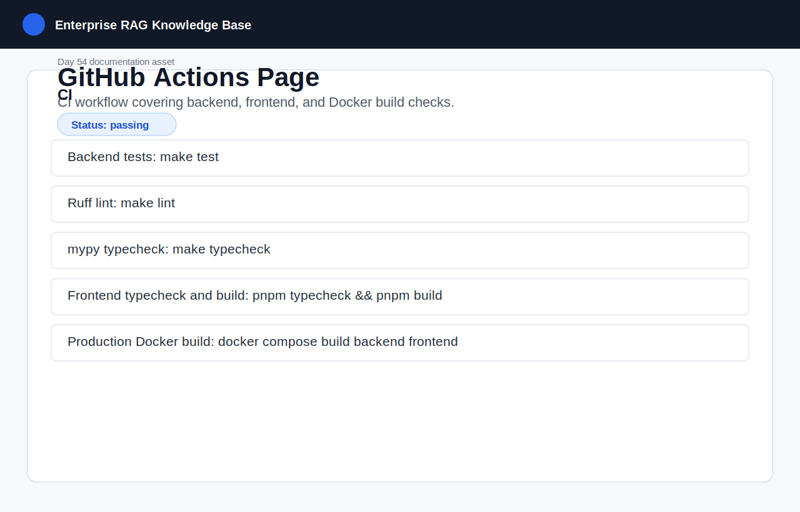
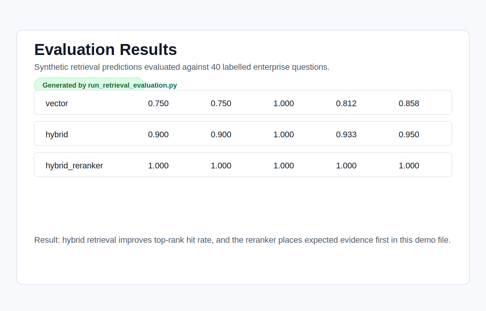

# Enterprise RAG Knowledge Base

Enterprise RAG Knowledge Base is a full-stack Retrieval-Augmented Generation system for private enterprise documents. It supports authenticated users, multiple knowledge bases, document ingestion, hybrid retrieval, reranking, multi-turn chat, streaming answers, source citations, evaluation tooling, Docker deployment, and GitHub Actions CI.

The project follows the 8-week development roadmap in `docs/development-roadmap.md`. Current status: v1.0.0 release preparation is complete and the repository is ready for GitHub release tagging, repository topics, and CV/interview use. A v2.0 workspace upgrade is now being developed on `feature/v2-workspaces`; the stable v1.0 line remains on `main`.

## Overview

The system lets a user create a knowledge base, upload enterprise documents, process them into searchable chunks, and ask grounded questions through a chat interface. Answers are generated from retrieved context and include source references so users can inspect where the response came from.

The default local providers are deterministic, which keeps development, tests, and demos reproducible without requiring external LLM or embedding API keys. Production-style settings can point the embedding, reranker, and LLM provider abstractions at external services.

## Key Features

- User registration, login, JWT authentication, and protected routes.
- Knowledge base CRUD with owner/editor/viewer permission checks.
- PDF, DOCX, TXT, and Markdown upload support.
- File validation by extension, MIME type, size, sanitized filename, and SHA-256 duplicate detection.
- Document parsing, recursive chunking, token-aware chunk metadata, and reprocessing.
- PostgreSQL, SQLAlchemy async engine, Alembic migrations, and pgvector-backed embedding storage.
- Vector retrieval, PostgreSQL full-text search, hybrid retrieval, Reciprocal Rank Fusion, and reranking.
- Metadata filters for document IDs, file types, date ranges, departments, and permissions.
- RAG query endpoint, retrieval debug endpoint, conversation persistence, and Server-Sent Events streaming chat.
- React frontend for auth, knowledge bases, document management, conversations, streaming chat, and citation details.
- Structured JSON logs, request IDs, unified API errors, retry/timeout/rate-limit handling, and evaluation scripts.
- Docker Compose development stack, production-style Compose stack, Nginx frontend serving, and GitHub Actions CI.

## System Architecture

```text
Browser / React / Vite
        |
        | HTTP + SSE
        v
FastAPI API server
        |
        | SQLAlchemy async
        v
PostgreSQL + pgvector
        |
        +-- document metadata
        +-- chunks and embeddings
        +-- users, permissions, conversations, messages

FastAPI also coordinates:
        +-- Redis cache/service dependency
        +-- file storage under storage/uploads
        +-- embedding provider abstraction
        +-- reranker provider abstraction
        +-- LLM provider abstraction
        +-- structured JSON logging
```

Production-style Docker Compose runs PostgreSQL, Redis, Alembic migration, FastAPI backend, and an Nginx-served React frontend. The frontend proxies `/api/v1` traffic to the backend service.

## RAG Pipeline

1. A user uploads a supported document into a knowledge base.
2. The backend validates file type, MIME type, size, filename, and duplicate hash.
3. The parser extracts text from PDF, DOCX, TXT, or Markdown content.
4. The chunker splits content into overlapping, metadata-rich chunks.
5. Embeddings are generated through the configured embedding provider.
6. Chunks and vectors are stored in PostgreSQL with pgvector.
7. A user asks a question through the RAG or chat endpoint.
8. Optional query rewriting converts follow-up questions into standalone questions.
9. Retrieval runs vector search and keyword search, then combines candidates with RRF.
10. The reranker reorders candidates and the prompt builder selects final context.
11. The LLM provider generates an answer grounded in the retrieved chunks.
12. The response returns answer text, source citations, scores, and request metadata.

## Technology Stack

| Area | Technology |
| --- | --- |
| Backend API | Python 3.11, FastAPI, Pydantic |
| Frontend | React, TypeScript, Vite |
| Database | PostgreSQL, pgvector |
| ORM and migrations | SQLAlchemy 2.0 async, Alembic |
| Cache/service dependency | Redis |
| Auth | JWT, password hashing |
| Retrieval | Vector search, PostgreSQL full-text search, RRF, reranking |
| Streaming | Server-Sent Events |
| Testing | pytest, pytest-asyncio |
| Quality | Ruff, mypy, TypeScript compiler |
| Deployment | Docker, Docker Compose, Nginx |
| CI/CD | GitHub Actions |

## Project Structure

```text
backend/                 FastAPI app, API routes, schemas, models, services, tests
frontend/                React/Vite frontend application
alembic/                 Database migration environment and revisions
docs/                    Roadmap and development logs
evaluations/             RAG evaluation dataset and prediction examples
scripts/                 Utility scripts such as retrieval evaluation
storage/                 Local upload storage, ignored except placeholders
.github/workflows/       GitHub Actions CI workflows
docker-compose.yml       Development Docker Compose stack
docker-compose.prod.yml  Production-style Docker Compose stack
```

## Detailed Documentation

- `docs/architecture.md`: system architecture, data model, request flow, and RAG pipeline.
- `docs/api.md`: API endpoints, response envelope, authentication, permissions, and examples.
- `docs/deployment.md`: local development, Docker Compose, migrations, production-style startup order, and CI.
- `docs/evaluation.md`: RAG evaluation dataset, prediction format, retrieval metrics, and debug workflow.
- `docs/security.md`: authentication, authorization, upload controls, secrets, logging, and hardening checklist.
- `docs/demo-data/`: synthetic Markdown documents for the Day 54 local demo flow.
- `docs/screenshots/`: SVG diagrams and page snapshots for GitHub display.
- `docs/demo-video.md`: 2-3 minute demonstration script, recording flow, narration, and checklist.
- `CHANGELOG.md`: v1.0.0 changelog and verification summary.
- `docs/release-v1.0.0.md`: GitHub release notes, tag commands, topics, and release checklist.
- `docs/cv-entry.md`: resume bullets, project summary, and interview talking points.

## Quick Start

### 1. Clone and configure

```bash
git clone https://github.com/Pengc-Sun/enterprise-rag-knowledge-base.git
cd enterprise-rag-knowledge-base
cp .env.example .env
```

For local Docker development, `.env.example` already points the backend at Compose service names. For local backend execution outside Docker, update `DATABASE_URL` and `REDIS_URL` if your services run on `localhost`.

### 2. Start the full development stack with Docker

```bash
make docker-up
```

This starts the backend, PostgreSQL with pgvector, and Redis. Use this path when you want the API running through Docker.

Backend URLs:

```text
Health:  http://localhost:8000/health
API:     http://localhost:8000/api/v1
Swagger: http://localhost:8000/docs
```

### 3. Run the backend from source instead

If you want to run FastAPI directly on your machine, start only PostgreSQL and Redis, set `.env` to use `localhost`, then run the backend:

```bash
docker compose up -d postgres redis
make install
make migrate-up
make dev
```

Do not run the Docker backend and `make dev` at the same time because both use port `8000`.

### 4. Install and run the frontend

```bash
cd frontend
pnpm install
pnpm dev
```

### 5. Run checks

```bash
make test
make lint
make typecheck
make check

cd frontend
pnpm typecheck
pnpm build
```

### 6. Production-style Docker validation

```bash
cp .env.production.example .env.production
# Edit secrets before using outside local validation.
make docker-prod-config PROD_ENV=.env.production
make docker-prod-up PROD_ENV=.env.production
make docker-prod-down
```

The production Compose stack builds the backend image, runs Alembic migrations as a one-shot service, serves the React build through Nginx, proxies `/api/v1` to the backend, and keeps PostgreSQL, Redis, and uploaded files on named volumes.

## Environment Variables

Copy `.env.example` for local development or `.env.production.example` for production-style validation.

| Variable group | Examples | Purpose |
| --- | --- | --- |
| App | `APP_NAME`, `APP_ENV`, `DEBUG`, `API_V1_PREFIX` | Runtime mode and API prefix. |
| Database | `DATABASE_URL`, `DATABASE_ECHO`, `POSTGRES_*` | PostgreSQL/pgvector connection and container settings. |
| Redis | `REDIS_URL` | Redis service URL. |
| Auth | `JWT_SECRET_KEY`, `JWT_ALGORITHM`, `ACCESS_TOKEN_EXPIRE_MINUTES` | JWT signing and token lifetime. |
| Uploads | `UPLOAD_DIR`, `MAX_UPLOAD_SIZE_BYTES` | Uploaded file location and size limit. |
| Embeddings | `EMBEDDING_PROVIDER`, `EMBEDDING_MODEL`, `EMBEDDING_API_KEY`, `EMBEDDING_BASE_URL`, `EMBEDDING_DIMENSION`, `EMBEDDING_BATCH_SIZE`, `EMBEDDING_MAX_RETRIES` | Embedding provider and retry configuration. |
| Retrieval | `RETRIEVAL_TOP_K`, `FINAL_CONTEXT_K`, `HYBRID_SOURCE_TOP_K`, `HYBRID_CANDIDATE_TOP_K`, `RRF_K` | Retrieval and final context sizing. |
| Conversations | `QUERY_REWRITE_ENABLED`, `QUERY_REWRITE_HISTORY_LIMIT`, `CONVERSATION_CONTEXT_LIMIT` | Follow-up rewriting and chat history limits. |
| Reranking | `RERANKER_PROVIDER`, `RERANKER_MODEL` | Reranker provider configuration. |
| LLM | `LLM_PROVIDER`, `LLM_MODEL`, `LLM_API_KEY`, `LLM_BASE_URL`, `LLM_TEMPERATURE`, `LLM_MAX_TOKENS`, `LLM_TIMEOUT_SECONDS`, `LLM_MAX_RETRIES` | Answer generation provider and reliability settings. |
| Logging | `LOG_LEVEL`, `LOG_JSON` | Structured logging behavior. |
| Frontend | `VITE_API_BASE_URL`, `FRONTEND_PORT` | Production frontend API path and Nginx port. |

Do not commit `.env` or real API keys. Rotate `JWT_SECRET_KEY`, database passwords, and provider keys before any shared deployment.

For OpenRouter, keep the provider set to `openai`, set `LLM_BASE_URL=https://openrouter.ai/api/v1`, and put the chat model slug such as `tencent/hy3:free` in `LLM_MODEL`. Embeddings are configured separately through `EMBEDDING_*`; use an OpenRouter embedding model and set `EMBEDDING_DIMENSION` to the model output size before uploading or reprocessing documents.

## API Documentation

Interactive API documentation is available at:

```text
http://localhost:8000/docs
```

All versioned endpoints are mounted under `/api/v1`.

### Auth

```text
POST /api/v1/auth/register
POST /api/v1/auth/login
GET  /api/v1/users/me
```

Example login response shape:

```json
{
  "success": true,
  "message": "Login successful",
  "data": {
    "access_token": "...",
    "token_type": "bearer"
  }
}
```

Use the token with:

```text
Authorization: Bearer <access_token>
```

### Knowledge Bases

```text
POST   /api/v1/knowledge-bases
GET    /api/v1/knowledge-bases
GET    /api/v1/knowledge-bases/{knowledge_base_id}
PATCH  /api/v1/knowledge-bases/{knowledge_base_id}
DELETE /api/v1/knowledge-bases/{knowledge_base_id}
```

### Documents

```text
GET    /api/v1/knowledge-bases/{knowledge_base_id}/documents
POST   /api/v1/knowledge-bases/{knowledge_base_id}/documents
POST   /api/v1/knowledge-bases/{knowledge_base_id}/documents/{document_id}/reprocess
DELETE /api/v1/knowledge-bases/{knowledge_base_id}/documents/{document_id}
```

Supported upload types are PDF, DOCX, TXT, and Markdown. Duplicate uploads are rejected by SHA-256 hash within the same knowledge base.

### RAG Query

```text
POST /api/v1/knowledge-bases/{knowledge_base_id}/query
POST /api/v1/knowledge-bases/{knowledge_base_id}/query/debug
```

Example request:

```json
{
  "question": "What is the maximum meal allowance?",
  "history": [],
  "filters": {
    "file_types": ["pdf"],
    "departments": [],
    "permissions": []
  }
}
```

The debug endpoint returns retrieval internals such as vector score, keyword score, RRF score, rerank score, and final rank.

### Conversations and Streaming Chat

```text
POST   /api/v1/knowledge-bases/{knowledge_base_id}/conversations
GET    /api/v1/knowledge-bases/{knowledge_base_id}/conversations
GET    /api/v1/knowledge-bases/{knowledge_base_id}/conversations/{conversation_id}
PATCH  /api/v1/knowledge-bases/{knowledge_base_id}/conversations/{conversation_id}
DELETE /api/v1/knowledge-bases/{knowledge_base_id}/conversations/{conversation_id}
GET    /api/v1/knowledge-bases/{knowledge_base_id}/conversations/{conversation_id}/messages
POST   /api/v1/knowledge-bases/{knowledge_base_id}/conversations/{conversation_id}/chat
POST   /api/v1/knowledge-bases/{knowledge_base_id}/conversations/{conversation_id}/chat/stream
```

Streaming chat uses Server-Sent Events for answer tokens, metadata, source citations, completion, and error events.

### Error Format

Failed API responses use a unified error object:

```json
{
  "success": false,
  "message": "LLM provider request timed out",
  "data": {
    "error": {
      "code": "gateway_timeout",
      "status_code": 504,
      "request_id": "...",
      "details": {}
    }
  }
}
```

## Evaluation Results

The evaluation assets live in `evaluations/`.

- `rag_qa_dataset.jsonl` contains 40 labelled synthetic enterprise questions.
- Each row includes category, difficulty, expected answer, expected document, expected page, aliases, required terms, and metadata filters.
- `scripts/run_retrieval_evaluation.py` computes Hit Rate@K, Recall@K, MRR@K, and nDCG@K.
- Prediction files compare `vector`, `hybrid`, and `hybrid_reranker` strategies.

Run retrieval evaluation with:

```bash
make eval-retrieval PREDICTIONS=evaluations/retrieval_predictions.jsonl
```

By default, a candidate must match both expected document and expected page. Use the script's `--document-only` option for document-level evaluation.

## Screenshots

Day 54 adds documentation-ready SVG snapshots and diagrams under `docs/screenshots/`. They are generated from the current UI, API, CI, and evaluation workflow so they render directly on GitHub.

| Asset | Preview |
| --- | --- |
| Architecture diagram |  |
| RAG pipeline diagram |  |
| Login page |  |
| Knowledge base page |  |
| Upload page |  |
| Chat page |  |
| Citation display |  |
| Swagger page |  |
| GitHub Actions page |  |
| Evaluation results |  |

Synthetic demo documents are available in `docs/demo-data/` and can be uploaded through the frontend for a repeatable local demo.

## Security Considerations

- `.env` files and provider API keys must stay out of git.
- JWT secrets and database passwords in example files are placeholders only.
- Passwords are hashed before storage.
- API routes enforce authenticated access where required.
- Knowledge base permissions isolate owner/editor/viewer access.
- Upload handling restricts file type, MIME type, file size, filename, and duplicate content.
- RAG answers are grounded in retrieved context and return source citations for inspection.
- Structured logs include request IDs for debugging; avoid logging provider secrets or uploaded document contents beyond necessary operational metadata.

## Known Limitations

- The default deterministic providers are for development, tests, and reproducible demos; production use should configure real embedding and LLM providers.
- Evaluation data is synthetic and should be replaced or extended with representative enterprise documents before production benchmarking.
- Background processing is currently implemented inside the application flow rather than a dedicated distributed worker queue.
- The production Compose setup is suitable for validation and small deployments, not a full Kubernetes or managed-cloud architecture.
- The project does not include a public hosted demo URL; the local demo flow and release notes are documented.

## Roadmap

Completed:

- Week 1: backend skeleton, Docker development environment, database setup, Alembic, unified responses, project scripts.
- Week 2: auth, JWT, users, knowledge bases, RBAC and permission isolation.
- Week 3: file model, upload validation, parsing, chunking, chunk persistence, document reprocessing.
- Week 4: embeddings, pgvector storage, vector retrieval, LLM abstraction, basic RAG, citations.
- Week 5: full-text search, hybrid retrieval, RRF, reranking, query rewriting, metadata filters, retrieval debug API.
- Week 6: conversations, streaming chat, React auth, knowledge base/document/chat frontend flows.
- Week 7: focused tests, integration/e2e API tests, RAG evaluation dataset, retrieval metrics, structured logging, unified errors, retry handling.
- Week 8: production Docker setup, GitHub Actions CI, complete README, detailed documentation, screenshots, demo data, demo video materials, changelog, release notes, and v1.0.0 release preparation.

Release follow-up:

- Commit and push release prep changes.
- Create and push the `v1.0.0` tag.
- Publish the GitHub Release using `docs/release-v1.0.0.md`.
- Add repository topics and attach the demo video as a release asset if available.

v2.0 upgrade progress:

- Week 1: workspace foundation, workspace/member/template models, migrations, CRUD APIs, role-based member management, built-in template APIs, and backend access-control test coverage.

## Development Logs

- `docs/development-roadmap.md`
- `docs/development-log/week-1.md`
- `docs/development-log/week-2.md`
- `docs/development-log/v2-week-1.md`

Week 3 through Week 8 completion summaries are included below in the acceptance status sections. v2.0 weekly upgrade summaries are added as each upgrade week closes.

## Week 1 Acceptance Status

- Docker Compose starts backend, PostgreSQL with pgvector, and Redis.
- `/health` returns success.
- `/api/v1/health/database` validates PostgreSQL connectivity.
- Swagger is available at `/docs`.
- Alembic upgrade and downgrade are verified.
- Pytest, Ruff, and mypy pass through `make check`.

## Week 2 Acceptance Status

- Users can register and log in.
- JWT authentication works.
- `/api/v1/users/me` returns the authenticated user.
- Users can create knowledge bases.
- Knowledge base owner/editor/viewer permissions are enforced.
- Unauthorized users cannot access private knowledge bases.
- Pytest, Ruff, and mypy pass through `make check`.

## Week 3 Acceptance Status

- PDF, DOCX, TXT, and Markdown files can be uploaded.
- Uploaded files are validated by extension, MIME type, size, and sanitized filename.
- Duplicate documents are rejected by SHA-256 hash within each knowledge base.
- PDF, DOCX, TXT, and Markdown parsing is covered by tests.
- Recursive, token-aware, overlap-aware, and section-aware chunking is implemented.
- Chunks are stored with document, knowledge base, page, section, token count, and JSON metadata.
- Documents can be reprocessed to replace stored chunks.
- Pytest, Ruff, and mypy pass through `make check`.

## Week 4 Acceptance Status

- pgvector extension and embedding storage are configured for document chunks.
- Chunk embedding status tracking, retry handling, and failure recording are implemented.
- Configurable embedding provider abstraction is available, including deterministic local embeddings for development and tests.
- Vector retrieval embeds user queries and returns top matching chunks within the selected knowledge base.
- Configurable LLM provider abstraction is available, including deterministic local responses for development and tests.
- Basic RAG query API answers questions using retrieved context.
- Source citations include document name, page number, chunk ID, original text, and similarity score.
- Insufficient context is handled with a safe response.
- Pytest, Ruff, and mypy pass through `make check`.

## Week 5 Acceptance Status

- PostgreSQL full-text search is configured for document chunks.
- Hybrid retrieval combines vector search and keyword search.
- Reciprocal Rank Fusion merges vector and keyword candidates.
- Cross-encoder-style reranking abstraction is integrated into the retrieval pipeline.
- Follow-up query rewriting uses conversation history to produce standalone questions.
- Metadata filtering supports document IDs, file types, dates, departments, and permissions before generation.
- Retrieval debug endpoint exposes vector score, keyword score, RRF score, rerank score, and final rank.
- Retrieval, reranking, query rewriting, and debug behavior are covered by tests.
- Pytest, Ruff, and mypy pass through `make check`.

## Week 6 Acceptance Status

- Conversation and message persistence are implemented.
- Multi-turn chat uses stored message history with configurable context limits.
- Server-Sent Events stream answer tokens and emit metadata, source citations, completion, and error events.
- React frontend supports registration, login, token-based route protection, and logout.
- Frontend knowledge base management supports list, create, details, edit, and delete actions.
- Frontend document management supports upload, list, processing status, chunk count, error display, reprocess, and delete actions.
- Frontend chat supports conversation list, new conversation, streaming messages, stop generation, copy answer, source cards, and citation detail modal.
- Week 6 acceptance flow is connected from login through knowledge base creation, document upload, and chat with citations.
- Backend tests pass and frontend production build passes.

## Week 7 Acceptance Status

- Core backend modules are covered by focused unit tests, including chunking, parsing, authentication, permissions, prompt construction, retrieval, reranking, query rewriting, streaming, and service behavior.
- Document ingestion integration tests cover upload, parse, chunk, embed, retrieve, and generate flow.
- End-to-end API tests cover register, login, knowledge base creation, document upload, RAG question answering, and source citation reads.
- RAG evaluation dataset contains 40 labelled enterprise questions with expected answer, document, page, aliases, required terms, and metadata filters.
- Retrieval evaluation metrics can be reproduced with Hit Rate@K, Recall@K, MRR@K, and nDCG@K across vector, hybrid, and hybrid-plus-reranker prediction files.
- Structured JSON logging includes request IDs, user IDs, knowledge base IDs, query text, retrieved chunk IDs, retrieval/rerank/LLM/total latency, token usage, status, and error details.
- API error responses use a unified error object with code, status code, request ID, and details.
- LLM provider calls include bounded retry handling for transient failures, timeout handling, and rate-limit handling.
- Evaluation documentation explains retrieval metric inputs and reliability/error semantics.
- Pytest, Ruff, and mypy pass through `make check`.

## Week 8 Acceptance Status

- Production-style Docker deployment is configured with PostgreSQL, Redis, Alembic migration, FastAPI backend, and Nginx-served React frontend.
- Docker startup order is health-gated so PostgreSQL and Redis are ready before migrations, backend startup, and frontend serving.
- GitHub Actions CI runs backend tests, Ruff, mypy, frontend typecheck/build, and production Docker image build checks.
- README is complete with overview, features, architecture, RAG pipeline, stack, quick start, environment variables, API guide, evaluation results, screenshots, limitations, roadmap, CI, and license.
- Detailed documentation is available for architecture, API, deployment, evaluation, and security.
- GitHub-ready screenshots and diagrams are included for architecture, RAG pipeline, login, knowledge bases, upload, chat, citations, Swagger, GitHub Actions, and evaluation results.
- Synthetic demo data is included for a repeatable local demo flow.
- Demo video materials include a 2-3 minute outline, narration script, recording checklist, troubleshooting notes, and release-asset guidance.
- Changelog, v1.0.0 release notes, repository topic suggestions, tag commands, and CV/interview project copy are prepared.
- v1.0.0 package/app versions are set across backend, frontend, and OpenAPI metadata.
- Final validation passed: pytest, Ruff, mypy, frontend typecheck/build, production Docker config/build, retrieval evaluation reproduction, and local secrets scan.

## v2.0 Week 1 Acceptance Status

- Workspace, workspace member, and workspace template SQLAlchemy models and Pydantic schemas are implemented.
- Alembic migrations create workspace tables, indexes, foreign keys, uniqueness constraints, and seed built-in templates.
- Authenticated users can create, list, read, update, and delete workspaces through `/api/v1/workspaces`.
- Workspace creation automatically creates an owner membership for the creator.
- Users only see workspaces they own or belong to.
- Workspace member APIs support listing, adding, updating, and removing assignable member roles.
- Owner membership is protected from member-management endpoints.
- Built-in workspace template list/detail APIs return active template definitions.
- Backend tests cover workspace CRUD, ownership, member roles, template listing, and key access-control boundaries.
- Backend verification passed with pytest, Ruff, and mypy on `feature/v2-workspaces`.

## CI

GitHub Actions runs on pushes to `main` and pull requests. The workflow checks backend tests, Ruff, mypy, frontend typecheck/build, and production Docker image builds.

## License

MIT License. See `LICENSE`.
